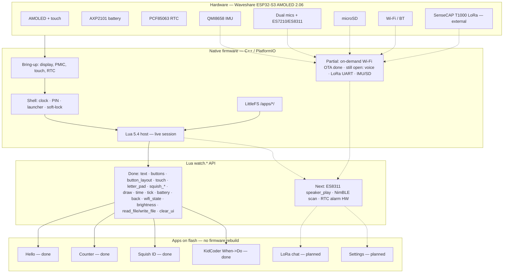

# Watch OS — Minimal shell for Waveshare AMOLED 2.06

> **Public curated snapshot.** Firmware + desktop simulator + a small set of example Lua apps
> (`tilt_maze`, `waterfall`, `pcm_lab`, `sound_deck`, `portal`, `mesh_chat`, …). See [EXAMPLES.md](EXAMPLES.md).
> Default unlock PIN in this tree is **`1234`** — change `include/app_secrets.h` before any real deploy.


Native OS scaffold: discreet **clock** cover → **PIN** unlock → **app launcher**
that lists LittleFS `/apps/*/app.json` and (when mounted) SD `/sd/apps/*/app.json`. Includes **Squish ID** as
an offline Lua app (LittleFS catalog + host letter pad) — not a return to the
old Squishmallow monolith.

**Fully offline after flash. All input is capacitive touch.**

## App icons & launcher

Default launcher is a **3-column icon grid** (optional list view). Icons are WRGB (`icon.wrgb`); see [docs/APP_ICONS.md](docs/APP_ICONS.md). Toggle Grid/List in **Set** (NVS `watchos` / `launcher_view`).

## Hardware

- Waveshare **ESP32-S3-Touch-AMOLED-2.06** (ESP32-S3R8, 8 MB OPI PSRAM, 32 MB flash)
- 2.06″ **410×502** capacitive-touch AMOLED (**CO5300** QSPI + **FT3168** I²C)
- Shared I²C (SDA=15, SCL=14): AXP2101 PMIC, PCF85063 RTC, touch
- USB-C for firmware + LittleFS (`uploadfs`)
- Optional 3.7 V MX1.25 battery + strap kit

### Power / PWR button (AXP2101)

| Action | How |
|--------|-----|
| **Power on** | **Click** the **PWR** button (short press) |
| **Power off** | **Hold PWR ~6 seconds** |

Firmware enables AXP2101 LDO rails (**ALDO1/2/3 @ 3.3 V, ALDO4 @ 1.8 V,
BLDO2 @ 2.8 V**) **before** `gfx->begin()`. Black screen after flash? Click
**PWR**, then check Serial.

Wiki: <https://www.waveshare.com/wiki/ESP32-S3-Touch-AMOLED-2.06>

## Screens (this scaffold)

1. **Clock** — discreet digital time / date; battery % (AXP2101); Lua/app-count hint; **Wi‑Fi icon** (off / OTA / transferring); tap to unlock
2. **PIN** — numeric pad; default `1234` in `include/app_secrets.h`
3. **Launcher** — scans `/apps/*/app.json` + `/sd/apps/*/app.json` (LFS wins on id); Lock → clock; Time; **Install** → OTA; **Manage** → uninstall; small Wi‑Fi status
4. **App screen** — live Lua 5.4 **or WASM (wasm3)** session for the package `entry` (`main.lua` / `main.wasm`); tick/back until Back (or `watch.back()`). Soft-lock does not close open apps. See `docs/WASM_APPS.md`.
5. **Set time** — hour/minute adjust → system clock + optional PCF85063
6. **Install / OTA** — SoftAP + HTTP upload window; Cancel / timeout turns Wi‑Fi **off**; **Manage Apps** shortcut
7. **Manage Apps** — list installed packages; tap → confirm → uninstall `/apps/<id>/` (see `docs/UNINSTALL.md`)

**Soft-lock:** after `WATCHOS_SOFT_LOCK_IDLE_SEC` idle seconds (default **60**) on
the launcher, Set time, Manage, or Settings, the watch returns to the clock cover.
Touch resets the idle timer. Soft-lock does **not** run while a Lua/WASM app is
open (`scrStub`), while entering PIN, or while Install / OTA is open (so games
like Portal Look and transfers are not interrupted).

If no apps are found on LittleFS, the launcher shows a placeholder **Hello** row.

## Build / flash

Requires [PlatformIO](https://platformio.org/) Core. Board JSON and partitions
are vendored under `boards/` and `partitions/`.

```bash
cd watchos

# First flash on a factory watch (CRITICAL — erase first):
pio run -t erase
pio run -t upload -t uploadfs

# Later code-only updates:
pio run -t upload

# Filesystem-only (apps under data/) after first flash:
pio run -t uploadfs

pio device monitor -b 115200
```

**Never run `uploadfs` alone on factory firmware** — it can corrupt the flash
map. Always erase (or upload app + fs together) on the first install.

Prefer **not** erasing on later updates — `pio run -t upload` and
`pio run -t uploadfs` are enough when the partition map is already correct.

`platformio.ini` uses pioarduino (Arduino-ESP32 3.3.x), LittleFS, XPowersLib,
Arduino_GFX 1.6.0, LVGL 9.3.0, and the FS include-path fix needed by that
toolchain.

**USB / flashing:** default env uses HW CDC/JTAG (`ARDUINO_USB_MODE=1`) so
`pio run -t upload` works on `/dev/ttyACM0`. USB SD (MSC) is optional env
`waveshare-amoled-206-msc` only — see [`docs/USB_FLASH.md`](docs/USB_FLASH.md)
and [`docs/USB_SD.md`](docs/USB_SD.md).

## Change the PIN / soft-lock

Edit `include/app_secrets.h`:

```c
#define WATCHOS_UNLOCK_PIN "1234"
#define WATCHOS_SOFT_LOCK_IDLE_SEC 60   // 0 disables soft-lock
```

Rebuild and `pio run -t upload`. Treat the PIN like a device passcode.

## `/apps` layout (Lua + WASM apps)

Also load from microSD: see [`docs/SD_APPS.md`](docs/SD_APPS.md).

Package apps into `data/apps/<folder>/` so PlatformIO `uploadfs` places them at
`/apps/<folder>/` on LittleFS:

```
data/apps/_example_hello/
  app.json      # required — id, name, version, entry
  README.txt    # optional notes
  main.lua      # entry script (executed by firmware)

data/apps/counter/
  app.json
  main.lua      # battery / back / vibrate demo

data/apps/squish_id/
  app.json
  main.lua      # tap-to-spell catalog search
  catalog.csv   # ~3757 Squishmallows (offline LittleFS)

data/apps/kidcoder/

data/apps/wasm_hello/
  app.json          # "kind":"wasm", "entry":"main.wasm"
  main.wasm
  main.c            # source; rebuild via tools/build_wasm_hello.sh
  icon.wrgb

  app.json
  main.lua      # When -> Do playground for kids
  README.txt
```

Example `app.json`:

```json
{"id":"hello","name":"Hello","version":"0.1.0","entry":"main.lua"}
```

The launcher parses these fields with a tiny string extractor (no full JSON
library). Tapping an app loads `/apps/<folder>/<entry>` with a **thin Lua 5.4
host** (base, string, math, table only — no io/os/package/debug).

### Lua API (`watch` table)

Apps keep a **live** `lua_State` while the stub screen is open (`luaHostOpen` /
`luaHostClose` / `luaHostPoll`). Leaving via **Back**, soft-lock, Lock→clock, or
`watch.back()` closes the session. `print()` still appends to the body + Serial.

```lua
-- Text / title
watch.set_title("My App")
watch.set_text("Hello\nmultiline body")
watch.append_text(" more")
watch.clear()              -- clears body text only

-- Timing / size (wall clock via time()/localtime)
watch.width()              -- e.g. 410
watch.height()             -- e.g. 502
watch.millis()             -- Arduino millis()
local t = watch.time()     -- {hour,min,sec,day,month,year,wday} (wday Sun=1)
watch.delay(ms)            -- capped at 500ms per call (avoids freezing UI)

-- Interactivity (requires live session firmware)
watch.button("Label", function() ... end)   -- max 10; extras soft-fail + message
watch.button_layout("column")               -- stacked buttons (default on app open)
watch.button_layout("grid2")                -- 2-col wrap (~180x40); optional cols: grid2, n
watch.button_layout("grid2", 2)             -- cols clamped 1..4 (grid modes)
-- clear_ui() clears widgets/slots but KEEPS the last layout mode until
-- button_layout() again or a new app open (which resets to column).
watch.touch()                               -- nil if no press; else {x=, y=, pressed=true}
watch.on_tick(function() ... end)           -- polled ~every 200ms from loop()

-- Device
local pct = watch.battery()  -- number 0..100, or nil if unavailable
watch.back()                 -- request return to launcher (deferred)
watch.vibrate()              -- GPIO18 motor pulse (~60ms)
local ws = watch.wifi_state()  -- "off" | "ota" ("on" reserved)
watch.brightness(0)          -- 0..100; returns clamped percent (CO5300)
watch.brightness()           -- get current 0..100
watch.idle_timeout([sec])    -- get/set soft-lock idle seconds (0=off)
watch.label / panel / progress / slider / z_raise
watch.on_back(fn) / on_long_press(fn) / gesture() / touch_delta()
watch.prefs_get/set  watch.sd_remove/rename
watch.now()  watch.set_alarm() -- alarm stub
watch.wifi_connect / wifi_disconnect / http_get  -- wifi off by default
watch.mic_start / mic_info / mic_read / mic_read_table / mic_spectrum / canvas_* (waterfall, pcm_lab); ble_* stubs
watch.install_zip / sprite / image_frame
watch.gpio_pwm/adc/write/read  -- pins 10,16,19,20

local imu = watch.imu()      -- QMI8658 {ax..az g, gx..gz dps}; nil if chip fail

-- Squish ID catalog (host C++ search over LittleFS CSV / PSRAM cache)
local n = watch.squish_count()           -- rows loaded (0 if catalog missing)
local hits = watch.squish_search("Pat")  -- up to 12 tables:
--   {name, full_name, animal, squad, size, retail_price_usd, bio}
watch.letter_pad(function(key)          -- host LVGL A–Z pad (not watch.button)
  -- key is "A".."Z", "BKSP", or "CLR"; cleared on luaHostClose
end)

-- Files (LittleFS; paths must start with /apps/, no ..)
local s = watch.read_file("/apps/kidcoder/rules.txt")  -- string or nil
local ok = watch.write_file(path, data)                 -- bool; max ~8KB
watch.clear_ui()   -- clear widgets + button slots; layout mode preserved

-- Simple draw (absolute screen coords on stub overlay)
watch.fill(r, g, b)                          -- stub screen background
watch.rect(x, y, w, h, r, g, b)
watch.circle(x, y, radius, r, g, b)
watch.text_at(x, y, "hi", r?, g?, b?)       -- optional RGB
```

Official Lua 5.4.7 sources are vendored under `lib/lua/
  lib/qrcode/          # vendored ricmoo/QRCode (Install SoftAP QRs)` with `LUA_32BITS=1`
(standalone `lua` / `luac` and unsafe libs omitted). Host glue: `src/lua_host.*`.

**Sync memory:** after this firmware, `.lua` / `app.json` changes are
`uploadfs`-only; API / host changes need a firmware `upload`.

### KidCoder (v1)

On-watch **When -> Do** playground for kids (not Scratch). ASCII-only UI.

1. Open **KidCoder** from the launcher.
2. Tap **Add** -> pick a When (Tick 1s / Tick 2s / Btn Go / Btn Boom / Shake).
3. Pick a Do (Text / Buzz / Color / Circle); text uses presets Hi! / Boom! / Wow!.
4. Tap **Run** — ticks fire on a timer; tap **Go** / **Boom** for button rules; shake is a no-op until IMU is real.
5. **Exit** (or Back). Rules reload next launch from `/apps/kidcoder/rules.txt`.

Needs firmware with `watch.read_file` / `write_file` / `clear_ui` / `button_layout` / `touch`
(flash firmware **and** FS). Home uses `watch.button_layout("grid2")` so all six
actions (Run, Add, Edit, Del, Help, Exit) fit in two columns without paging.

### How to add a Lua app

1. Create `data/apps/<folder>/app.json` with `id`, `name`, `version`, `entry`.
2. Add `data/apps/<folder>/<entry>` (usually `main.lua`) using the API above.
3. Flash FS: `pio run -t uploadfs` (or include `-t uploadfs` with firmware).

Bring-up notes carried from the proven AMOLED 2.06 project:

- AXP2101 before `gfx->begin()` (battery ADC enabled when PMIC ok)
- Boot splash via Arduino_GFX before LVGL
- `LittleFS.begin(false)` (no auto-format on mount)
- Soft-lock + Lua session always closed when returning to the clock cover

## Architecture — done vs planned



**Solid lines** = working today. **Dotted** = planned.

Hardware: vibrate = GPIO18 motor; imu = QMI8658 (I2C SDA=15 SCL=14, addr 0x6B, INT1 GPIO21) via lewisxhe/SensorLib.

**Done:** native shell (clock, PIN, launcher, soft-lock, battery + Wi‑Fi icon on cover), on-demand SoftAP OTA, Lua live session, Hello + Counter + **Squish ID** + **KidCoder** on LittleFS, `watch.*` including wifi_state / brightness / imu (QMI8658) / `squish_*` / `letter_pad` / `read_file` / `write_file` / `clear_ui` / `button_layout` / `touch`.

**Still open:** ES8311 speaker playback, NimBLE, RTC alarm HW, then LoRa chat / Settings as apps. Mic spectrum + waterfall + fine `mic_read` PCM (`pcm_lab`) shipped.

### Radios / OTA policy (EMF) — implemented

Wi‑Fi stays **off by default** (forced `WIFI_OFF` at boot). WatchOS runs fully
offline day-to-day. USB `uploadfs` remains the default app install path and
needs no RF.

**On-demand Install / OTA** (launcher → **Install**):

1. Open **Install / OTA** (radio still off until you tap a start action).
2. **Phone SoftAP** (universal — no home SSID needed): SoftAP `WatchOS-OTA`
   with a random 8-char session password. Scan the **Wi‑Fi QR**
   (`WIFI:T:WPA;S:…;P:…;;`) to join, then tap the QR (or scan the page QR)
   for `http://<IP>/?k=<session>`. Upload apps from that page.
3. **Save home Wi‑Fi** (optional, for Ethernet LAN PCs): on the SoftAP page,
   use **Save home Wi‑Fi** to store SSID + password in **on-device NVS**
   (per watch — not in shared firmware). Password is never shown in full on
   the watch UI afterward (SSID may show).
4. **Home Wi‑Fi**: watch joins the saved AP, shows IP + **page QR**
   (`http://<ip>/?k=<session-token>`). If nothing is saved, the watch tells
   you to provision from the SoftAP page first. Optional compile-time
   `WATCHOS_WIFI_STA_*` in `app_secrets.h` is a **developer fallback only**.
5. `POST /upload` requires `?k=` matching the session password. Cancel /
   timeout / clock cover → radio **off**, QRs hidden. Optional mDNS:
   `http://watchos.local/`.

**Clock / launcher Wi‑Fi icon states**

| State | Icon cue | Caption |
|-------|----------|---------|
| Off (default) | muted `Wi/` | `off` |
| OTA idle (AP up) | `WiFi` accent | `OTA` |
| Transferring | animated `Wi.` / `Wi..` / `Wi...` | `...` |

**v1 HTTP upload limits**

- SoftAP **or** STA (STA uses NVS creds saved from SoftAP page; optional `WATCHOS_WIFI_STA_*` dev fallback).
- Accepts **individual files** via `POST /upload?app=<folder>` multipart field
  `file` → writes `/apps/<folder>/<filename>`.
- Upload `app.json` then `main.lua` (and any other assets) one at a time.
- **Does not unpack zip** archives in v1 — send raw files.
- Example:
  `curl -F file=@main.lua "http://<IP>/upload?app=my_app&k=<session-token>"`
- **microSD**: `POST /upload_sd?path=<rel>&k=<session>` multipart `file` →
  `/sd/<rel>` (e.g. `path=squish/img/abby.wrgb`). Bulk helper:
  `python3 tools/push_squish_sd.py --stage tools/squish_sd_stage/img --host <IP> --k <token>`.

**Lua additions**

- `watch.wifi_state()` → `"off"` | `"ota"` ( `"on"` reserved for future STA)
- `watch.brightness(0..100)` → sets CO5300 brightness; returns clamped percent
- `watch.imu()` → QMI8658 accel (g) + gyro (dps); `nil` if init failed


### Squish ID (Lua app)

Offline name lookup. Firmware hosts CSV search in PSRAM (`src/search.*`); the
UI is a LittleFS Lua package — **no Wi‑Fi**.

| Piece | Path |
|-------|------|
| App | `data/apps/squish_id/{app.json,main.lua,catalog.csv}` |
| On device | `/apps/squish_id/` (launcher id `squish_id`) |
| Host search | Prefer `/apps/squish_id/catalog.csv`, else `/squishmallows.csv`, else tiny PROGMEM fallback |
| Letter entry | `watch.letter_pad(cb)` — LVGL buttonmatrix A–Z + BKSP/CLR (not limited to 10 `watch.button`s) |
| Button layout | `watch.button_layout("column"|"grid2"[, cols])` — clear_ui keeps mode |
| Touch poll | `watch.touch()` → nil or `{x,y,pressed=true}` (FT3168 / LVGL indev) |

**Update the catalog:** replace `data/apps/squish_id/catalog.csv`, then
`pio run -t uploadfs` (or OTA-upload that file into `/apps/squish_id/`).
Firmware rebuild is only needed if search/host APIs change.

**Use:** unlock → launcher → **Squish ID** → tap letters → matches show name +
retail price → **More** pages results → **Exit** / native Back → launcher.

## Roadmap (not implemented here)

- Richer Lua bindings (SD/files, real IMU, mic listen hooks)
- Zip unpack / multi-file package install over OTA
- ~~**Squish ID**~~ — shipped as `data/apps/squish_id/` (see below)
- **LoRa chat** peer messaging (SenseCAP T1000 transport; watch as UI)
- **KidCoder** When->Do learning / scripting playground — **done (v1)**
- Settings app (soft-lock timeout, PIN, brightness presets)
- Display sleep polish

## Project layout

```
watchos/
  platformio.ini
  README.md
  boards/waveshare-esp32-s3-touch-amoled-206.json
  partitions/large_littlefs_32MB.csv
  include/pin_config.h, app_secrets.h, lv_conf.h
  lib/lua/
  lib/qrcode/          # vendored ricmoo/QRCode (Install SoftAP QRs)                 # Lua 5.4.7 sources + library.json
  src/main.cpp, wifi_ota.*, lua_host.*, search.*, squish_db.h, ft3168.*, pcf85063.*, apps_host.*
  data/apps/_example_hello/{app.json,main.lua}
  data/apps/counter/{app.json,main.lua}
  data/apps/squish_id/{app.json,main.lua,catalog.csv}
```

## License / attribution

This project is licensed under the **MIT License** — see [LICENSE](LICENSE).

Board bring-up patterns align with Waveshare’s public ESP32-S3-Touch-AMOLED-2.06
examples and the working AMOLED 2.06 PlatformIO setup used elsewhere in this
workspace. Squish ID reuses the catalog CSV + prefix-search approach as a
**Lua LittleFS app** on Watch OS (not the old monolith UI).
